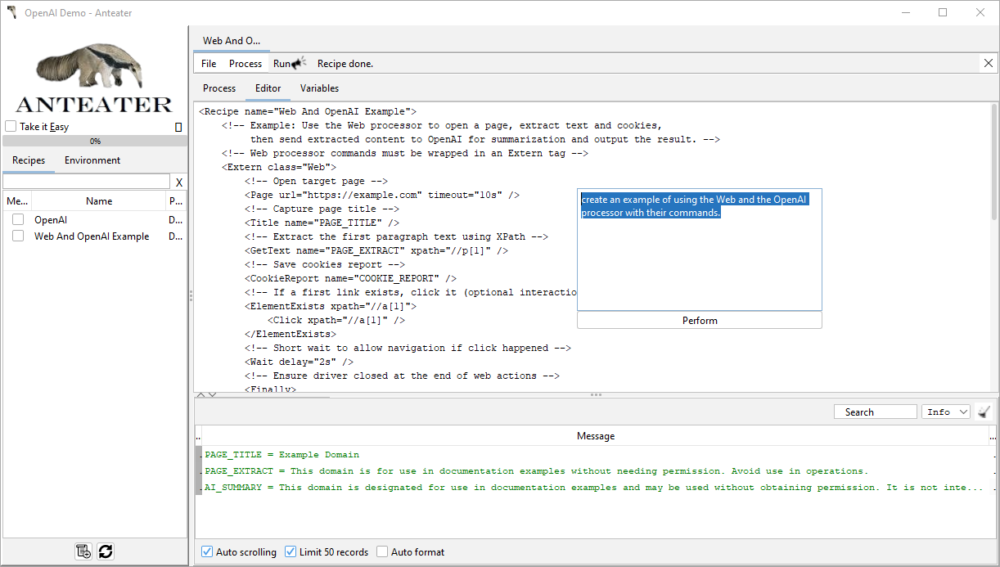

# IA Anteater Plugin

The **AI-AE-Plugin** is an Anteater plugin that introduces support for AI-powered workflows by integrating with Large Language Models (LLMs) like OpenAI GPT. This plugin enables users to generate content dynamically within Anteater recipes and provides command processors.

**Features**:

- **AI-Powered Recipe Code Generation**:
		Use the `<Editor helper="AICodeHelper" apiKey="$var{OPENAI_API_KEY}"/>` configuration to interact with LLMs and generate recipe code.
- **AI-Powered Content Generation**:
		Use the commands LLM plugin processors to interact with LLMs and generate text-based responses.
- **Customizable Models**:
		Specify the model (e.g., `gpt-5`) to tailor the response to your needs.
- **Seamless Integration**:
		Easily integrate AI responses into your Anteater workflows using variables and output commands.

## Prerequisites

1. Install Anteater[^1], see: [Run Anteater, Run](https://ganteater.com/run-anteater-run.html).
2. To use the AI-AE-Plugin, you can either download the JAR file directly or add it as a Maven dependency to your project.
	- Download the Plugin: [AI Anteater Plugin](https://sourceforge.net/projects/anteater/files/plugins/ai-ae-plugin.jar/download)
	- Or add as Maven Dependency:  
		You can include the plugin in your Maven project by adding the following dependency to your `pom.xml` file:
		```xml
		<dependency>
			  <groupId>com.ganteater.plugins</groupId>
			  <artifactId>ai-ae-plugin</artifactId>
			  <version>latest_version</version>
		 </dependency>
		 ```
		[](https://search.maven.org/artifact/com.ganteater.plugins/ai-ae-plugin)
4. Install other plugins (optional), see: [Anteater Plugins](https://ganteater.com/ae-plugins/index.html)
3. OpenAI API Key:
	- Ensure you have a valid OpenAI API key.[^2]

## AI Code Helper

### Configuration

To use the **AI Code Helper** feature, you need to add the `<Editor>` configuration tag in your Anteater configuration file (`ae.xml`). This enables the integration with AI-powered tools like OpenAI for code assistance.

> Note: AICodeHelper only works with the [desktop version of Anteater](https://ganteater.com/anteater-desktop/index.html).

Example Configuration:

Below is an example of how to configure the AI Code Helper in `ae.xml`:

```xml
<Environment>
	<Configuration name="My Configuration">
		<!-- Define the OpenAI API Key -->
		<Var name="OPENAI_API_KEY" init="console" type="password" />

		<!-- Enable AI Code Helper -->
		<Editor helper="AICodeHelper" apiKey="$var{OPENAI_API_KEY}"/>
	</Configuration>
</Environment>
```

Editor attributes:

- The `helper="AICodeHelper"` attribute specifies the AI Code Helper to enable.
- The `apiKey` attribute specifies the apiKey to authenticate OpenAI requests.
- The `model` specifies the OpenAI model to use. Supported values:
  - `gpt-5`
  - `gpt-5-mini` (default)
- The `debug` enables debug mode for logging additional information during LLM request execution (optional).

With this configuration, Anteater is ready to leverage AI capabilities for code assistance, enhancing your workflows with intelligent suggestions and automation.

### How to Use

1. Open the Recipe Editor:  
	Start by opening the recipe editor in your Anteater environment.

2. Activate Code Helper:  
	- Press `Ctrl+Space` or right-click and select **`Code Helper`** from the popup menu.
	- Ensure the cursor is not positioned directly after `<` or on a tag name. Otherwise, the [command helper](https://ganteater.com/anteater-desktop/command-helper.html) will be displayed instead.

3. Command Code Helper:  
	When activated correctly, the code helper will assist with generating or completing Anteater commands:

	 

This feature simplifies the process of writing recipes and ensures accurate syntax and command usage.
## LLM Command Processors

### Command Processor: OpenAI

The **OpenAI processor** is the core component of this plugin, allowing Anteater recipes to call OpenAI services seamlessly. It supports commands for generating responses and managing conversations using OpenAI's models.

Fully Qualified Class Name: `com.ganteater.ae.processor.OpenAI`.

Example:

```xml
<Extern class="OpenAI" apiKey="$var{OPENAI_API_KEY}" model="gpt-5-mini">
	<!-- commands -->
</Extern>
```

#### Supported Commands

##### Command: `<Prompt>`
The `<Prompt>` command is used to send a query to an LLM and store the generated response in a variable. This command is highly flexible and can be used in a variety of scenarios, such as content generation, summarization, or creative tasks.

Attributes:

- **`name`**:
		Defines the variable name where the LLM's response will be stored.
- **Text Content**:
		The content inside the `<Prompt>` tag is the query or instruction sent to the LLM.

Example Usage:

Below is an example recipe that demonstrates how to use the `<Prompt>` command with the AI-AE-Plugin to generate a short poem about the beauty of nature.

```xml
<Prompt name="AI_PROMPT_RESPONSE">
	Please rewrite the poem as a 4-line version using simpler language and an uplifting tone while keeping vivid imagery.
</Prompt>
<Out name="AI_PROMPT_RESPONSE" />
```

##### Command: `Messages`

The `<Messages>` command is used to manage multi-turn conversations with OpenAI's models by exchanging a series of messages. Each message includes a `role` (e.g., `system`, `developer`, or `user`) and its content.

Attributes:

- **`name`**: Defines the property name where the response will be stored.

Example:

```xml
<Messages name="responseText">
	<message role="system">You are a helpful poet that writes concise, imagery-rich poems.</message>
	<message role="user">Write a short poem about the beauty of nature.</message>
</Messages>
<Out name="responseText" level="info" />
```

## Resources

[^1] Anteater Documentation: [http://ganteater.com](http://ganteater.com)
[^2]: OpenAI API Documentation: [https://platform.openai.com/docs/](https://platform.openai.com/docs/)


